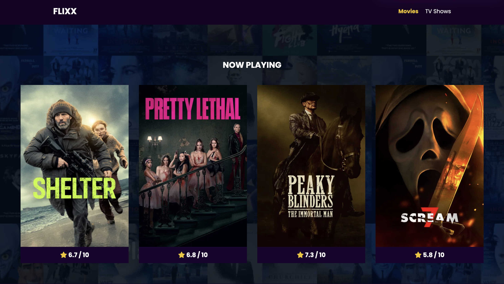

    

# Film API Explorer
This is a vanilla JavaScript web app that uses The Movie Database (TMDB) API to browse popular movies and TV shows. You will be able to view detailed information about each movie or TV show and also search for titles.

## Live Demo
[View Site](https://warm-choux-6923cc.netlify.app/)

# Technologies
- HTML5
- CSS3
- Vanilla JavaScript (ES6+)
- [TMDB API](https://www.themoviedb.org/)
- Swiper.js
- Netlify (deployment)

# Features
- Popular Movies and TV shows currently displayed from API to the DOM
- Each movie or TV show can be clicked, and the details are displayed using the movie or show ID
- "Now Playing" Slider that autoscrolls through movies recently released
- Search Bar on the Home page to search both TV shows and movies, sorted by popularity (default of TMDB)
-  search results have pagination and "Previous" and "Next" buttons

# Process of Creating the Project
- used fetch API method and JavaScript forEach array method to have popular movies with posters and titles visible in the DOM
- did the same process to have popular TV shows visible on a separate page in the website
- manipulated the HTML to show TV and movie details of each media title that was clicked
- added a backdrop image to all TV and movie detail pages
- added slider feature for movies that were "Now Playing"
- used provided search feature from API to have movies and TV shows be searchable and displayed to the page with pagination 
- deployed project to Netlify 

# What I learned
- how to work with a third-party API using fetch and authorization headers
- how to find particular search results using URLSearchParams
- how to integrate third-party libraries like Swiper.js
- how to handle conditional rendering of images within template literal strings
- implementing pagination 

# How It Could be Improved
- adding a "Favorites" feature to view and save shows/movies
- adding more actor details to each media title and maybe having specific pages for actors as well
- move API token to a backend service so it's not exposed in the frontend code
